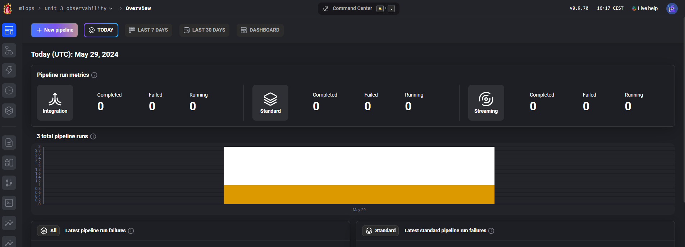
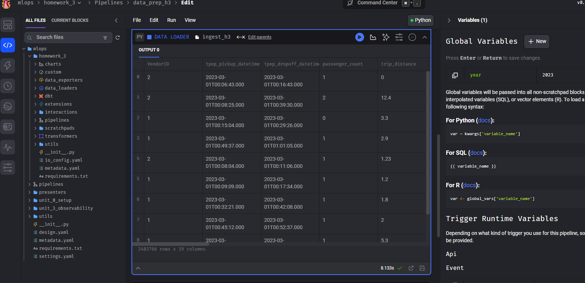
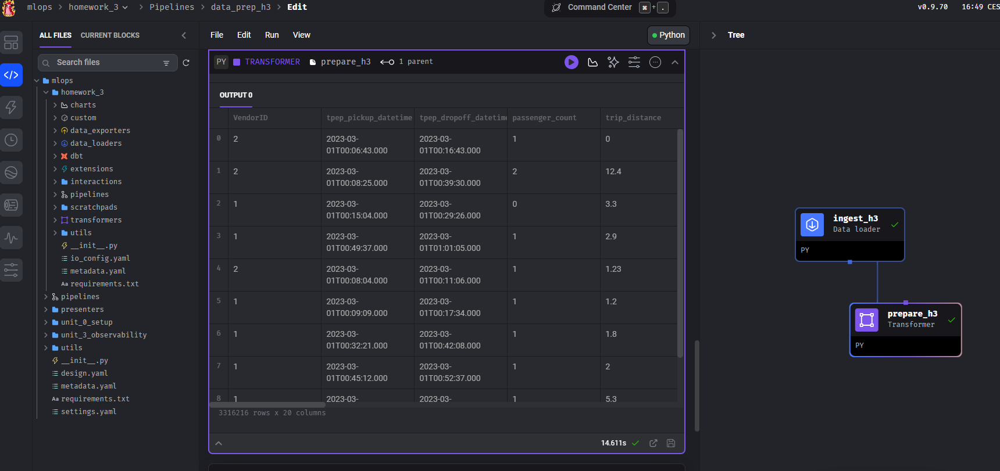
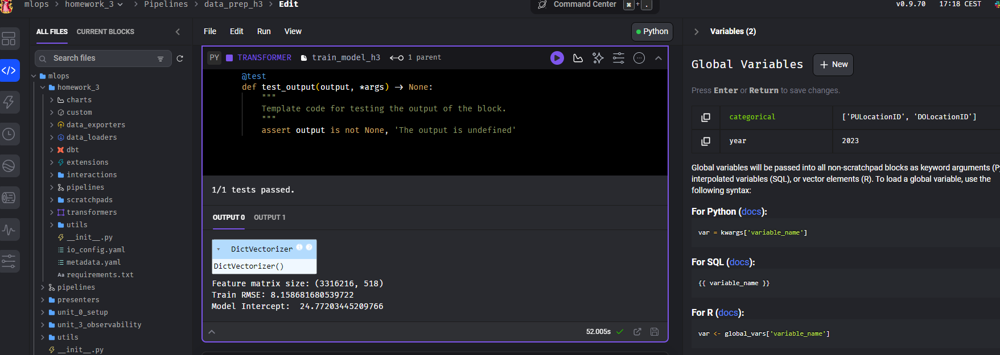

## Homework
My code for the homework is in the project `homework_3` on the [folder `homework_3`](./homework_3/)

The goal of this homework is to train a simple model for predicting the duration of a ride, but use Mage for it.

We'll use [the same NYC taxi dataset](https://www1.nyc.gov/site/tlc/about/tlc-trip-record-data.page), the **Yellow** taxi data for 2023. 

## Question 1. Run Mage

First, let's run Mage with Docker Compose. Follow the quick start guideline. 

What's the version of Mage we run? 

(You can see it in the UI)

**Answer**: v0.9.70

Execute the docker compose to open Mage:



## Question 2. Creating a project

Now let's create a new project. We can call it "homework_03", for example.

How many lines are in the created `metadata.yaml` file? 

- 35
- 45
- 55
- 65

**Answer**: 55

The metadata fiel contains 55 lines:
```yaml
project_type: standalone

variables_dir: ~/.mage_data
# remote_variables_dir: s3://bucket/path_prefix

variables_retention_period: '90d'

emr_config:
  # You can customize the EMR cluster instance size with the two parameters
  master_instance_type: 'r5.4xlarge'
  slave_instance_type: 'r5.4xlarge'

  # Configure security groups for EMR cluster instances.
  # The default managed security groups are ElasticMapReduce-master and ElasticMapReduce-slave
  # master_security_group: 'sg-xxxxxxxxxxxx'
  # slave_security_group: 'sg-yyyyyyyyyyyy'

  # If you want to ssh tunnel into EMR cluster, ec2_key_name must be configured.
  # You can create a key pair in page https://console.aws.amazon.com/ec2#KeyPairs and download the key file.
  # ec2_key_name: '[ec2_key_pair_name]'

spark_config:
  # Application name
  app_name: 'my spark app'
  # Master URL to connect to
  # e.g., spark_master: 'spark://host:port', or spark_master: 'yarn'
  spark_master: 'local'
  # Executor environment variables
  # e.g., executor_env: {'PYTHONPATH': '/home/path'}
  executor_env: {}
  # Jar files to be uploaded to the cluster and added to the classpath
  # e.g., spark_jars: ['/home/path/example1.jar']
  spark_jars: []
  # Path where Spark is installed on worker nodes
  # e.g. spark_home: '/usr/lib/spark'
  spark_home:
  # List of key-value pairs to be set in SparkConf
  # e.g., others: {'spark.executor.memory': '4g', 'spark.executor.cores': '2'}
  others: {}
  # Whether to create custom SparkSession via code and set in kwargs['context']
  use_custom_session: false
  # The variable name to set in kwargs['context'],
  # e.g. kwargs['context']['spark'] = spark_session
  custom_session_var_name: 'spark'

help_improve_mage: true
notification_config:
  alert_on:
  - trigger_failure
  - trigger_passed_sla
  slack_config:
    webhook_url: "{{ env_var('MAGE_SLACK_WEBHOOK_URL') }}"
  teams_config:
    webhook_url: "{{ env_var('MAGE_TEAMS_WEBHOOK_URL') }}"
project_uuid: homework_3

```

## Question 3. Creating a pipeline

Let's create an ingestion code block.

In this block, we will read the March 2023 Yellow taxi trips data.

How many records did we load? 

- 3,003,766
- 3,203,766
- 3,403,766
- 3,603,766

**Answer**: 3,403,766




## Question 4. Data preparation

Let's use the same logic for preparing the data we used previously. We will need to create a tranformer code block and put this code there.

This is what we used (adjusted for yellow dataset):

```python
def read_dataframe(filename):
    df = pd.read_parquet(filename)

    df['duration'] = df.tpep_dropoff_datetime - df.tpep_pickup_datetime
    df.duration = df.duration.dt.total_seconds() / 60

    df = df[(df.duration >= 1) & (df.duration <= 60)]

    categorical = ['PULocationID', 'DOLocationID']
    df[categorical] = df[categorical].astype(str)
    
    return df
```

Let's adjust it and apply to the data we loaded in question 3. 

What's the size of the result? 


- 2,903,766
- 3,103,766
- 3,316,216 
- 3,503,766

**Answer**: 3,316,216

Add a transform block, modify the code and run it:


## Question 5. Train a model

We will now train a linear regression model using the same code as in homework 1

* Fit a dict vectorizer
* Train a linear regression with default parameres 
* Use pick up and drop off locations separately, don't create a combination feature

Let's now use it in the pipeline. We will need to create another tranformation block, and return both the dict vectorizer and the model

What's the intercept of the model? 

Hint: print the `intercept_` field in the code block

- 21.77
- 24.77
- 27.77
- 31.77

**Answer**: 24.77

When we train the model in a new Transformer block we get the results:


## Question 6. Register the model 

The model is traned, so let's save it with MLFlow.

If you run mage with docker-compose, stop it with Ctrl+C or 

```bash
docker-compose down
```

Let's create a dockerfile for mlflow, e.g. `mlflow.dockerfile`:

```dockerfile
FROM python:3.10-slim

RUN pip install mlflow==2.12.1

EXPOSE 5000

CMD [ \
    "mlflow", "server", \
    "--backend-store-uri", "sqlite:///home/mlflow/mlflow.db", \
    "--host", "0.0.0.0", \
    "--port", "5000" \
]
```

And add it to the docker-compose.yaml:

```yaml
  mlflow:
    build:
      context: .
      dockerfile: mlflow.dockerfile
    ports:
      - "5000:5000"
    volumes:
      - "${PWD}/mlflow:/home/mlflow/"
    networks:
      - app-network
```

Note that `app-network` is the same network as for mage and postgre containers.
If you use a different compose file, adjust it.

We should already have `mlflow==2.12.1` in requirements.txt in the mage project we created for the module. If you're starting from scratch, add it to your requirements.

Next, start the compose again and create a data exporter block.

In the block, we

* Log the model (linear regression)
* Save and log the artifact (dict vectorizer)

If you used the suggested docker-compose snippet, mlflow should be accessible at `http://mlflow:5000`.

Find the logged model, and find MLModel file. What's the size of the model? (`model_size_bytes` field):

* 14,534
* 9,534
* 4,534
* 1,534

**Answer**: 4,534

The model logged in Mlflow:


## Persist models and artifacts 

Connect to the mlflow container:
```bash
docker exec -ti mlops-mlflow-1 /bin/bash
```
We can check that artifacts are saved in `mlartifacts`, not in `/home/mlflow`.

By default the Mlflow Server saves artifacts into its local folder `/mlartifacts`, that is removed when the container is recreated or rebuilt.

We include a new volumne in the docker-compose file to persist that folder in the local machine:
```
- "${PWD}/mlartifacts:/mlartifacts/" 
```

Now, every run, params, model or artifact logged is stored in our local machine and MLflow server can access it in its local folder by default.


